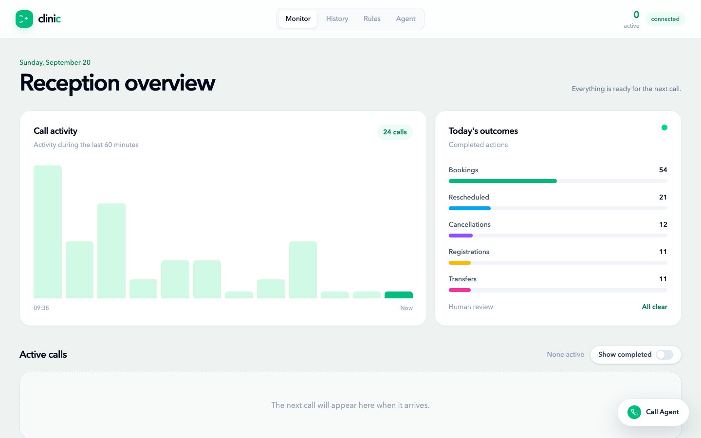
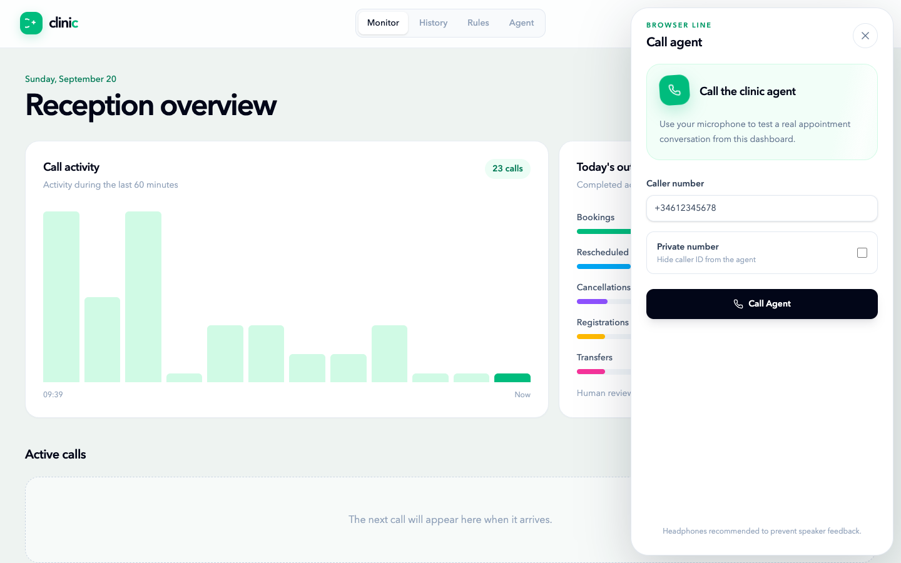
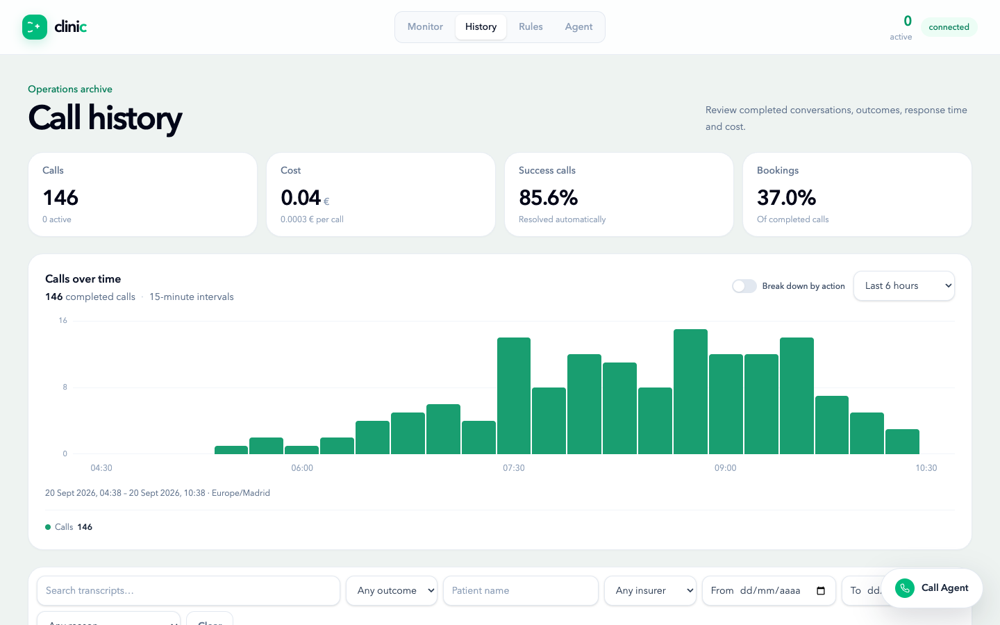
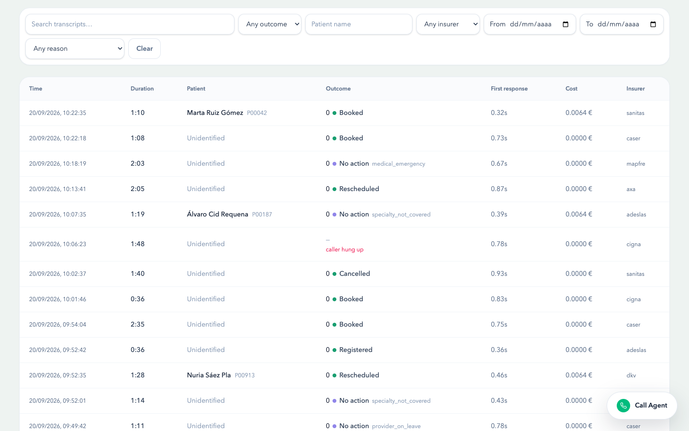
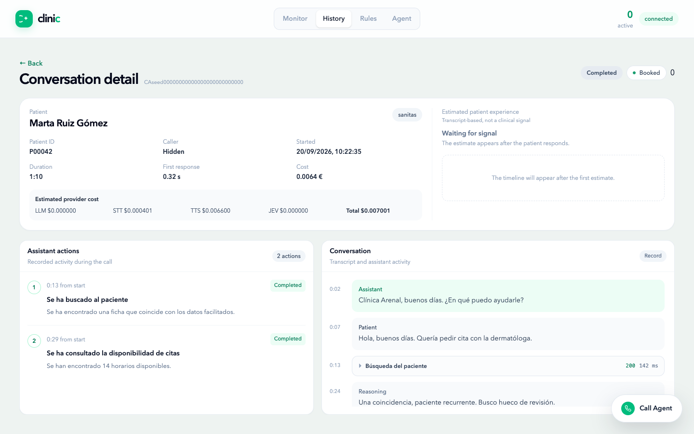
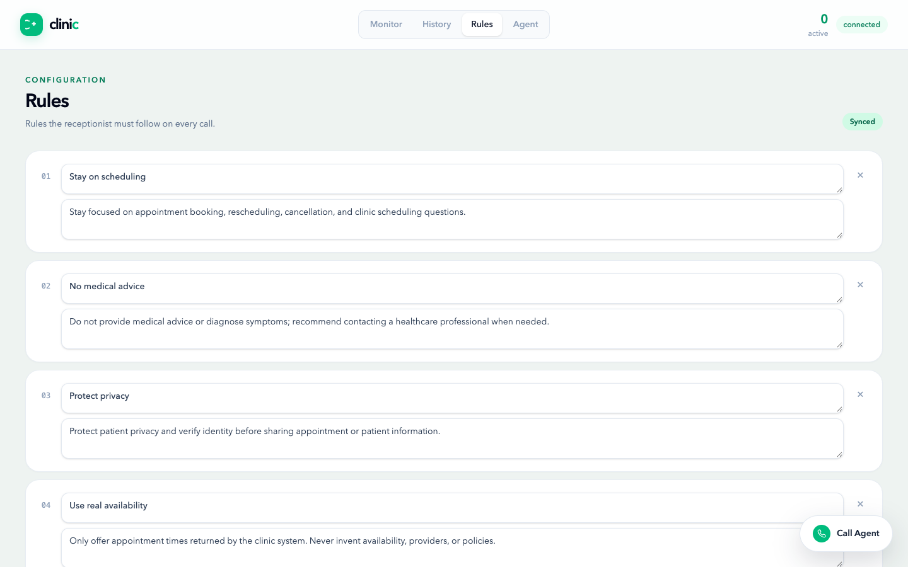
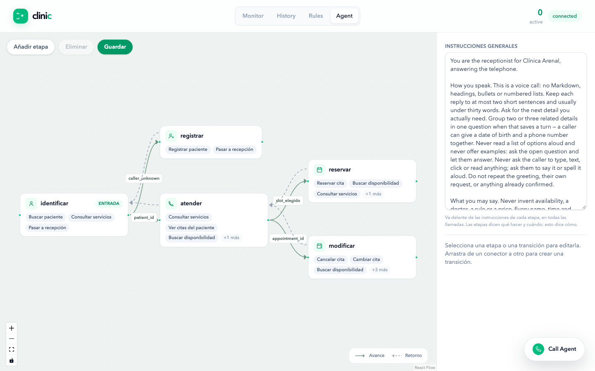
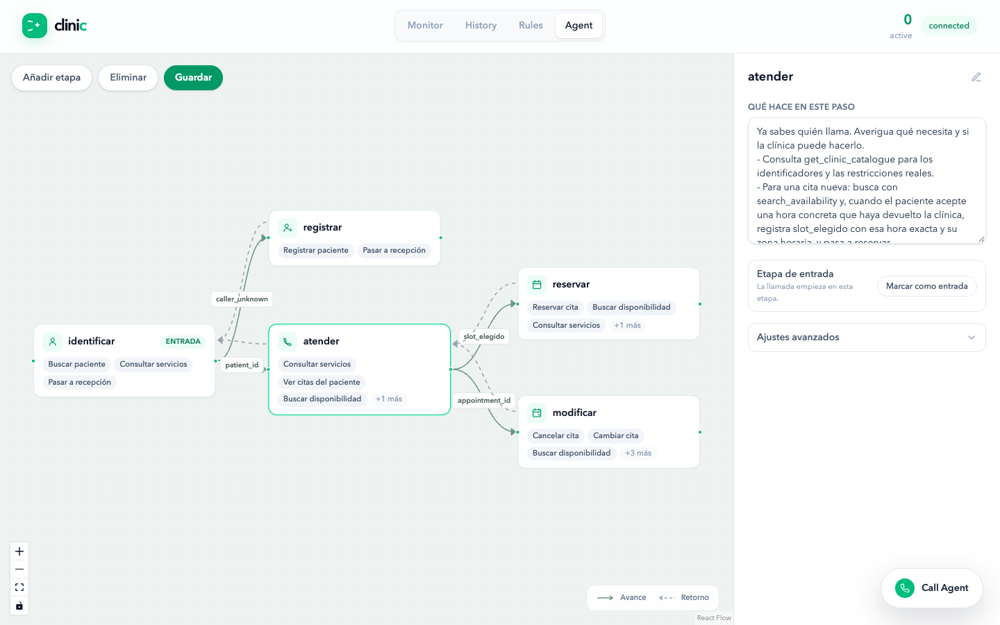

# Clinic console — user guide

The console is the web dashboard served next to the voice agent. Start the
project with `./run.sh` and open the frontend URL it prints. There is no login;
the top bar shows the live call count and whether the browser is connected to
the agent.

Four views: **Monitor**, **History**, **Rules**, **Agent**. The floating
**Call Agent** button is available everywhere.

## 1. Monitor — what is happening right now

- **Call activity**: calls in the last 60 minutes.
- **Today's outcomes**: bookings, reschedules, cancellations, registrations and
  transfers to staff completed today. **Human review** turns red when a call
  needs attention.
- **Active calls**: one card per call in progress, updated live with the
  patient, the agent's current action and its quality score. Toggle
  **Show completed** to keep finished calls on the wall.
- A card turns red when the score drops or a safety rule is breached. From the
  card you can **Stop agent** (end the call) or **Take over** (see §4).

## 2. Test the agent from the browser

1. Click **Call Agent** (bottom right).
2. Set the **Caller number** the agent will see, or tick **Private number** to
   hide it — this is how the agent looks the patient up.
3. Click **Call Agent** and speak. Use headphones. **Mute** and **End call**
   are in the drawer; minimise it to keep browsing while the call runs.
4. When the call ends, **View call details** opens the conversation.

## 3. History — every finished call

The headline cards give totals, cost, the share of calls resolved automatically
and the booking rate. **Calls over time** can be broken down by action and
narrowed to any range, from the last 15 minutes to custom dates.

Filter by transcript text, outcome, patient name, insurer, reason or dates.
Click a row to open the conversation detail.

## 4. Conversation detail

- **Patient**: who was identified, caller number, timing, cost per provider.
- **Estimated patient experience**: satisfaction estimated from the transcript,
  plotted along the call.
- **Assistant actions**: each tool the agent ran, in order, with what it found.
- **Conversation**: the transcript with the agent's reasoning and tool calls
  inline; expand a tool call to see the request and response. The chip reads
  **Live** while the call is running and **Record** once it has ended.

On a **live** call the same page adds staff controls:

- **Instruct the agent** — type a note (e.g. "Only offer afternoon slots"); the
  agent applies it on the caller's next turn and it appears in the transcript
  as *Clinic staff*.
- **Transfer call** → **Confirm transfer** — the agent tells the caller a
  colleague is taking over, records the escalation and connects your browser
  microphone to the line. **End call** hangs up when you are done.
- **Terminate call** appears in the amber banner when a call needs attention.

## 5. Rules — what the agent must always respect

Plain-language rules injected into every call (stay on scheduling, no medical
advice, protect privacy, only offer real availability…). Edit the text inline,
**+ Add rule** or delete with **×**. Changes save automatically — the badge
shows **Synced** — and apply to the next call.

## 6. Agent — how the receptionist works

The agent is a graph of stages (*identificar → atender → reservar / modificar*,
plus *registrar* for unknown callers). Each stage lists the tools it may use;
solid arrows advance, dashed arrows return. The right panel holds the general
instructions shared by every stage.

Click a stage to edit its instructions, mark it as the entry stage or open
advanced settings; drag from one connector to another to add a transition.
**Añadir etapa** creates a stage, **Eliminar** removes the selected one, and
**Guardar** publishes the graph — it takes effect on the next call.
