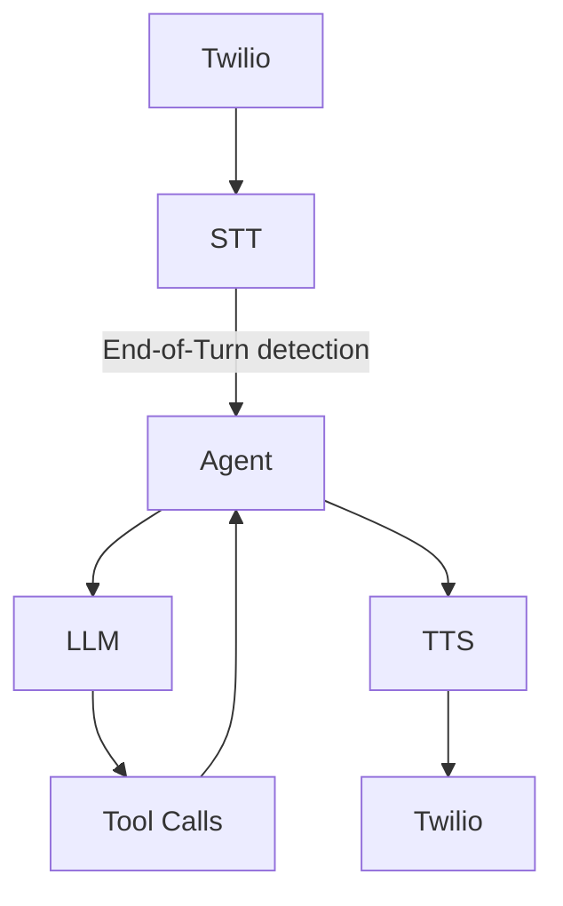

```mermaid
flowchart TD
    TW_IN[Twilio] --> STT[STT]

    STT -->|End-of-Turn detection| AGENT[Agent]

    AGENT --> LLM[LLM]
    LLM --> TOOLS[Tool Calls]
    TOOLS --> AGENT
    AGENT --> TTS[TTS]

    TTS --> TW_OUT[Twilio]
```
